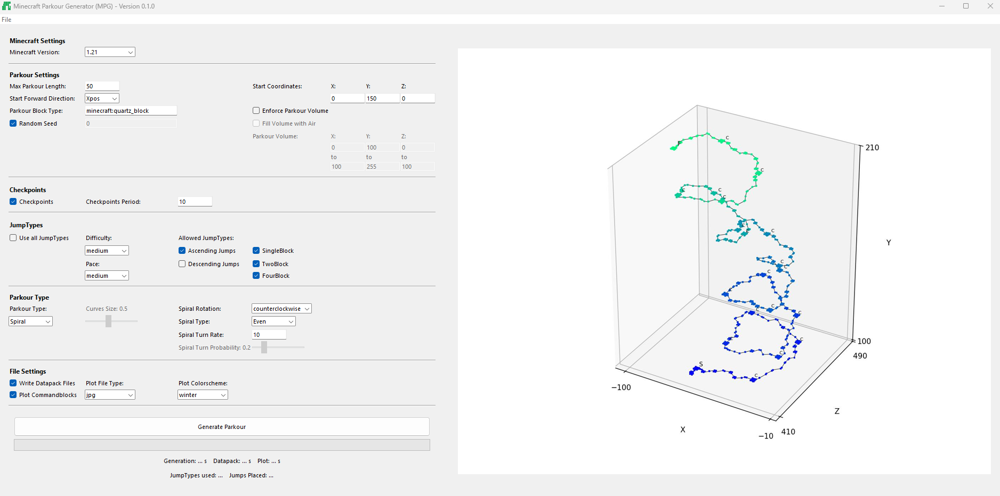

# Minecraft Parkour Generator (MPG)

    

MPG is a parkour generator for Minecraft Java Edition (Vanilla). It is based on Minecraft function files which allow to place multiple blocks in a Minecraft world with only one in-game command.

Supported Java Edition versions: `1.13 - 1.21`

    

    

## Features
* Fast generation for thousands of jumps
* Checks for shortcuts and world boundary
* Settings for start location and volume where the parkour should be generated
* Automatic checkpoint system:
    * Set after how many jumps a checkpoint should be placed
    * Respawn at a checkpoint by using the fishing rod
* Many different jump-types:
    * Ascending and descending jumps
    * Set difficulty and pace of jumps
* Different parkour types:
    * Straight, Curves, Spiral, Random

## How to use
The app creates a datapack which you can copy and paste into your Minecraft world's datapack folder.

1. IMPORTANT: Create a new minecraft world (in-game as usual) or create a backup of the world you are going to place the parkour into. If the parkour is filled into your world it might be difficult to undo the changes depending on the parkour settings.
2. Generate a parkour with MPG.
3. Copy the `parkour_generator_datapack` created by MPG.
4. Open your Minecraft's `saves` folder (Usually at `C:\Users\<your_username>\AppData\Roaming\.minecraft\saves`).
5. Open the world folder you want the parkour to be placed in.
6. Paste `parkour_generator_datapack` into the `datapacks` folder.
7. Open the world in Minecraft and use the command `/reload`.
8. Use the command `/function parkour_generator:generate` to place the parkour.

(Optional) You can use `/function parkour_generator:remove` to fill the placed parkour blocks with air. This will not revert any blocks that were destroyed by generating the parkour or filling the parkour volume with air. It will only fill the placed parkour blocks with air.

If you generate a new parkour, you have to copy and paste the datapack into the datapack folder again such that the function files get overwritten. You can stay in the Minecraft world while doing this, but you have to use the `/reload` command to load the new function files.

You can find the explanation for all the parkour settings in [SETTINGS.md](SETTINGS.md)

## Installation

### Windows
1. Download the latest release [here](https://github.com/LeandroTreu/mc-parkour-generator/releases). 
2. Extract the `zip` file and move the `MPG` folder to your Desktop or where you can find it again. The entire application is inside the folder (no installation needed).
3. Double-click `MPG.exe`.

### Linux/macOS
For Linux and macOS it is best to build the app from source:

1. MPG requires Python version 3.12.3. Install `Python 3.12.3`, open a terminal, and make sure you're using the correct version with: `python --version`
2. Download the `Source code (zip)` [here](https://github.com/LeandroTreu/mc-parkour-generator/releases).
3. Extract the `zip` and open a terminal in the `mc-parkour-generator-0.2.0` folder.
4. Create and activate a virtual environment to download all the dependencies: `python -m venv .venv && source .venv/bin/activate`
5. Install all dependencies with: `python -m pip install -r src/requirements.txt`
6. Build the app with: `cd src && chmod 744 build.sh && ./build.sh`
7. Copy the created MPG folder in `src/dist/MPG` to your Desktop. The entire application is inside the folder.
8. Double-click `MPG`.

## Advanced Installation and Usage
Python version 3.12.3 was used to develop the application. You can find all needed pip packages in `requirements.txt`. The main imports are Matplotlib and Pillow. PyInstaller was used to build the executable.

MPG can also be used as a CLI application. Just disable the GUI by setting use_gui to False in `MPG.py`. All settings can be set in the `settings.json` file and are documented in [SETTINGS.md](SETTINGS.md).
## License
Minecraft Parkour Generator (MPG) is licensed under GPL-3.0-or-later.

The MPG logos and icons are licensed under <a href="https://creativecommons.org/licenses/by-nd/4.0/?ref=chooser-v1" target="_blank" rel="license noopener noreferrer" style="display:inline-block;">CC BY-ND 4.0</a>

## Credits
### Idea for the Checkpoint System
The idea for how to make the checkpoints and teleport system was inspired by the following YouTube video:

Author|Phibby27
-|-
Name|How To Make A Parkour Checkpoint Teleporter In Minecraft
Video|https://www.youtube.com/watch?v=Rx2kBtBlPso&list=WL&index=1
